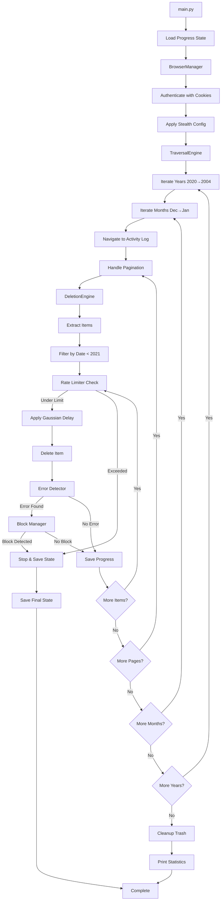

# Facebook Cleanup - Automated Content Deletion

Automated deletion of Facebook content created before 2021 using browser automation.

## Overview

This project provides a programmatic solution for bulk deletion of historical Facebook content. It uses Playwright to automate the deletion process through Facebook's legacy mobile interface (`mbasic.facebook.com`) with built-in safety measures to avoid account lockouts.

### System Architecture



## Prerequisites

- Python 3.8 or higher
- pip (Python package manager)
- Git (for cloning the repository)

## Installation

### 1. Clone the Repository

```bash
git clone <repository-url>
cd facebook-cleanup
```

### 2. Create Virtual Environment

```bash
python3 -m venv venv
source venv/bin/activate  # On Windows: venv\Scripts\activate
```

### 3. Install Dependencies

```bash
pip install -r requirements.txt
```

### 4. Install Playwright Browsers

```bash
playwright install chromium
```

### 5. Configure Environment

Copy the example environment file and edit it:

```bash
cp config/.env.example .env
```

Edit `.env` and set:
- `FACEBOOK_USERNAME`: Your Facebook username or user ID
- `LOG_LEVEL`: Logging level (DEBUG, INFO, WARNING, ERROR)
- `HEADLESS`: Set to `true` to run browser in headless mode (default: `false`)

### 6. Export Facebook Cookies

**Important**: You must manually log into Facebook in a regular browser and export your session cookies.

1. Log into Facebook in your browser
2. Use a browser extension like "EditThisCookie" or browser DevTools to export cookies
3. Save the cookies to `data/cookies.json` in the following format:

```json
{
  "cookies": [
    {
      "name": "c_user",
      "value": "...",
      "domain": ".facebook.com",
      "path": "/"
    },
    {
      "name": "xs",
      "value": "...",
      "domain": ".facebook.com",
      "path": "/"
    }
  ],
  "origins": []
}
```

**Note**: The `data/` directory is gitignored for security. Never commit cookies to version control.

## Usage

### Running the Cleanup

Once cookies are configured, run the cleanup script:

```bash
python main.py
```

The script will:
1. Load saved progress (if exists) and resume from last position
2. Create authenticated browser session
3. Navigate through Activity Log by year and month
4. Extract and delete items created before 2021
5. Save progress after each page
6. Handle errors and blocks automatically
7. Display final statistics

### Resume Capability

If the script is interrupted (Ctrl+C) or encounters an error:
- Progress is automatically saved to `data/progress.json`
- Run the script again to resume from the last position
- Already processed items are skipped

### Interrupting the Script

Press `Ctrl+C` to interrupt:
- Current progress is saved
- Browser resources are cleaned up
- You can resume later by running the script again

### Error Handling

The script automatically handles:
- **Rate Limit Exceeded**: Stops and logs instructions
- **Block Detected**: Stops immediately, saves state, logs wait period
- **Session Expired**: Prompts for cookie refresh
- **Network Errors**: Retries with backoff
- **Transient Errors**: Skips problematic items and continues

### Monitoring Progress

Progress is displayed in real-time:
- Current year/month being processed
- Items deleted per page
- Total statistics
- Errors encountered

Logs are saved to `data/logs/` for detailed review.

For detailed implementation information, see `DESIGN_DOCUMENT.md`.

## Project Structure

```
facebook-cleanup/
├── src/                    # Source code
│   ├── auth/              # Authentication modules
│   ├── traversal/         # Activity Log navigation
│   ├── deletion/          # Deletion handlers
│   ├── stealth/           # Anti-detection modules
│   ├── safety/            # Rate limiting, error detection
│   └── utils/             # Utilities (logging, state)
├── config/                # Configuration files
├── data/                  # Data files (gitignored)
│   ├── cookies.json       # Session cookies
│   ├── progress.json      # Resume state
│   └── logs/              # Execution logs
├── tests/                 # Test suite
├── main.py                # Entry point
├── requirements.txt       # Python dependencies
└── DESIGN_DOCUMENT.md     # Detailed design document
```

## Configuration

Key settings are defined in `config/settings.py`:

- **Rate Limiting**: Max 50 deletions per hour (default)
- **Delays**: Gaussian distribution with mean 5s, std dev 1.5s
- **Target**: Content before 2021
- **Interface**: mbasic.facebook.com (legacy mobile)

## Safety Features

- **Rate Limiting**: Automatic throttling to prevent blocks
- **Error Detection**: Detects Facebook error messages and stops
- **Progress Tracking**: Saves state for resuming after interruptions
- **Stealth Mode**: Browser fingerprint masking and behavioral simulation
- **Backoff Strategy**: Exponential delays after errors

## Logging

Logs are written to:
- **Console**: INFO level and above
- **File**: All levels (DEBUG+) in `data/logs/cleanup_YYYYMMDD_HHMMSS.log`

## Troubleshooting

### Session Expired
- Re-export cookies from your browser
- Ensure cookies are in the correct format

### Playwright Not Found
- Run `playwright install chromium`
- Ensure Playwright is installed: `pip install playwright`

### Import Errors
- Ensure virtual environment is activated
- Verify all dependencies are installed: `pip install -r requirements.txt`

## Development

### Running Tests

```bash
pytest tests/
```

### Code Style

Follow PEP 8 Python style guidelines.
